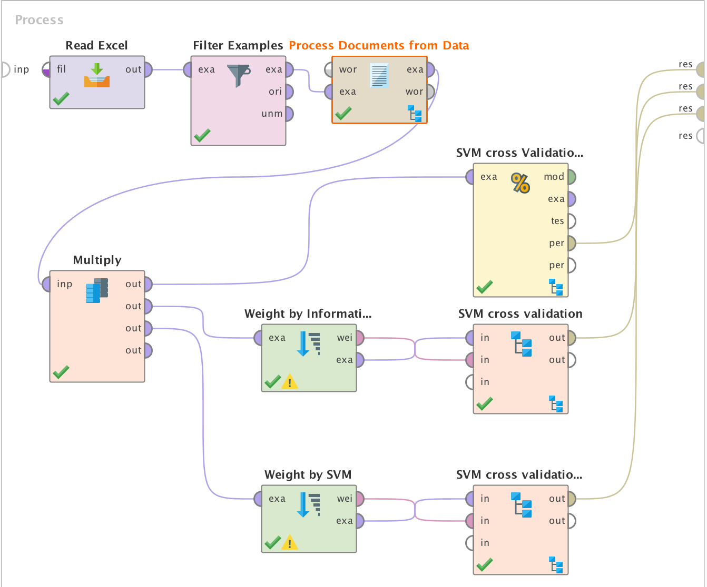
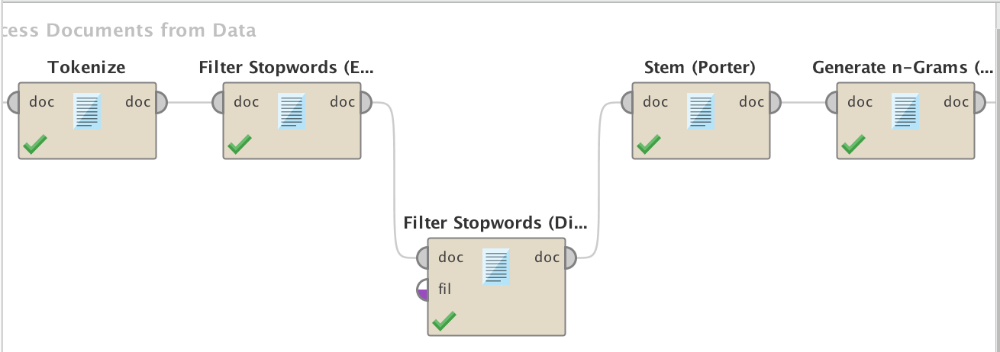

## Solución implementada para caso de estudio "Identificación de sexo por lo que se escribe en artículos"
[Volver](../index.md)

En este se busca predecir cual es el sexo de la persona que escribió una entrada de blog. Para ello utilizaremos la herramienta RapidMiner y Excel, además del [dataset](http://www.cs.uic.edu/~liub/FBS/blog-gender-dataset.rar) sobre blogs con su sexo.

### Paso 1
Descargar el dataset

### Paso 2
Limpiar con Excel el formato que tiene cada celda, ya que RapidMiner tiene problemas con el formateo que tiene las celdas del dataset original.
Además se llevaron todas las letras que identifican el género de la persona a mayúsculas y se le sacaron espacios incesarios.

### Paso 3
Leer el archivo de excel desde un bloque apropiado en RapidMiner para ello y seguido eliminar todos los missing values correspondientes a los blogs.

### Paso 4
Descargar el plugin para text mining dentro de las extensiones de RapidMiner.
Utilizar el operador Process Document from Data y dentro de este se utilizarán bloques para la creación de tokens.
Este operador se configurá con un vector de  TF-IDF, es decir que tendrá en cuenta la frecuencia de cada token inversamente a la frecuencia en el documento.

### Paso 5
- Dentro del operador Process Document from Data se utilizará el operador **Tokenize**, para separar el texto por palabras con el modo non letters, es decir las letras sueltas como 'a' no serán parte de los tokens resultados.
- Luego se filtrarán los stop words **(Filter Stopwords English)** del idioma ingles como 'the'.
- Tambíen un stop words personalizado **(Filter Stopwords Dictionary)** en el que se carga en un archivo una expresión regular de cosas que no queremos que formen parte de los tokens generados, como ser espacios o saltos de línea.
- Se aplicará **Stem Porter**, para obtener la raíz de las palabras (tokens), de manera que independientemente de la conjugación de la palabra se agrupe a una misma.
- Por último se generan nuevos tokens, con **Generate n-grams**, estos nuevos tokens son para tener en cuenta el contexto de la palabra en este caso se eligio que se tenga en cuenta a hasta 2 palabras consecutivas.

### Paso 6
Se paso a realizar un multiply para generar 3 modelos, entrenados con el algoritmo de SVM y validados con cross validation.
Uno de los modelos se ingresan todos los atributos y es el que menor precisión tuvo con  67.35% +/- 2.38% 
El otro se tiene en cuenta los pesos de los atributos por ganancia de información y se tomaron aproximadamente un 1/3 de los atributos con mejor peso, obteniendo una precisión de de 73.36% +/- 2.67% .
El útlimo modelo se tiene el cuenta el peso de cada atributo por SVM, y este caso se obtuvo la mejor precisión 84.59% +/- 2.44%.

Distribución por peso de los atributos por SVM

[Represetanción en Rapid Miner](./Process.zip)

[Excel estudio de atributos por ganacia atributos en SVM](./AttributesWeights.xlsx)

[Volver](../index.md)