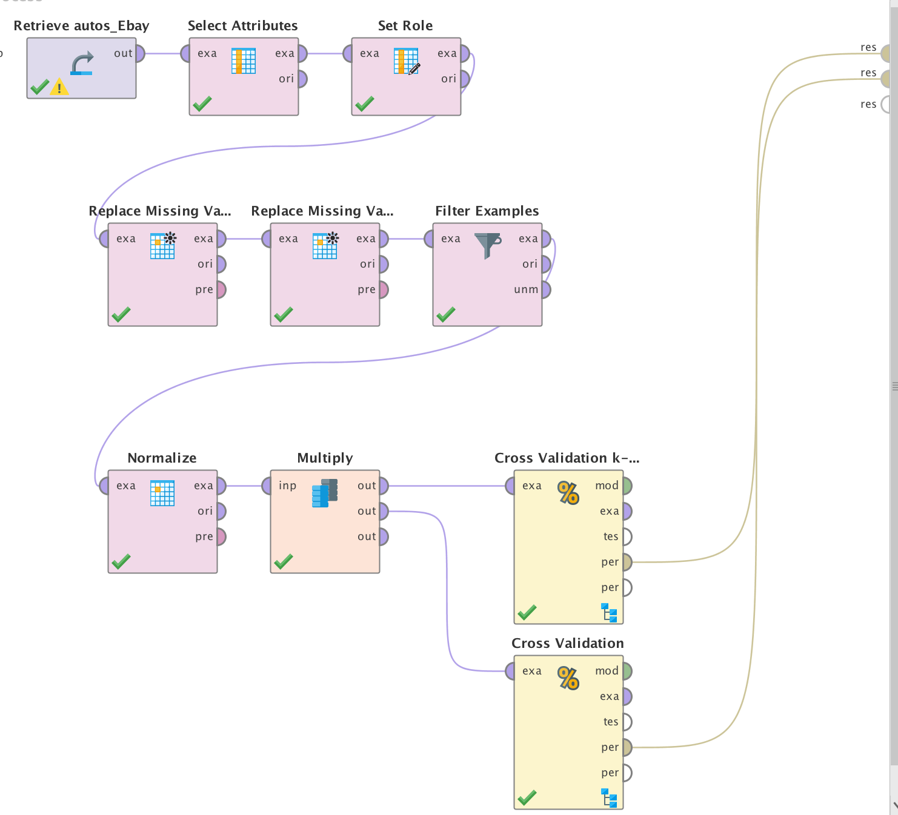

## Solución implementada para caso de estudio "Predicción de costo de automóviles usados"
[Volver](../index.md)

En este caso buscaremos intentaremos predecir el costo de un vehículo usado que va a ser publicado en ebay. 
 [Dataset](./autos_Ebay.csv).

### Paso 1 - Análsisis de atributos
Analizar cada atributo del dataset.
En este paso se sacaron por falta de relevancia los siguientes atributos.
dateCrawled, 
name,
seller,
offerType,
monthOfRegistration,
dateCreated,
nroPictures,
PostalCode


### Paso 2 - Inspección de atributos con missing values
Se inspeccionaron los siguientes atributos
-	Gearbox y fueltype se mantuvieron y se utilizó la moda para completar los atributos faltantes
-	notRepairedDamage se eliminó debido a la cantidad de atributos faltantes.
-	El resto de los atributos se mantuvieron, eliminando únicamente los atributos faltantes.

Atributos que quedaron
-	Price (label)
-	yearOfRegistration
-	powerPS
-	kilometer
-	fuelType
-	gearbox
-	vehicleType
-	model
-	brand


### Paso 3 - Normalización
Se normalizaron aquellos atributos númericos salvo la variable de salida con el fin de que una variable su valur no tuviera mayor incidencia que otro, cuando se utilizara algún algoritmo como k-nn.

### Paso 4 - Algoritmo k-nn
Primero se estudio como el modelo performaba con k-nn.
Siendo el mejor valor k = 5 con la opción de weighted vote activa.
Se valido el modelo generado con cross validation obteniendose los siguientes resultados.

```
squared_correlation: 0.758 +/- 0.067 (mikro: 0.749)
correlation: 0.869 +/- 0.039 (mikro: 0.866)
root_mean_squared_error: 3946.308 +/- 780.476 (mikro: 4022.746 +/- 0.000)
```

### Paso 5 - Algoritmo Gradient Boosted Trees
Luego probó el algoritmo gradient boosted trees.
Incialmente con 20 árboles, max depth 5.

```
squared_correlation: 0.795 +/- 0.067 (mikro: 0.785)
correlation: 0.891 +/- 0.038 (mikro: 0.886)
root_mean_squared_error: 3810.784 +/- 853.025 (mikro: 3905.090 +/- 0.000)
```

Con 100 árboles mejoró.
```
squared_correlation: 0.802 +/- 0.061 (mikro: 0.794)
correlation: 0.895 +/- 0.035 (mikro: 0.891)
root_mean_squared_error: 3555.006 +/- 788.325 (mikro: 3641.363 +/- 0.000)
```

Con 200 árboles empeoró
```
squared_correlation: 0.792 +/- 0.066 (mikro: 0.781)
correlation: 0.889 +/- 0.038 (mikro: 0.884)
root_mean_squared_error: 3662.828 +/- 827.270 (mikro: 3755.088 +/- 0.000)
```

### Conclusión
Se obtuvieron valores bastantes cercanos con ambos algoritmos, aunque Gradient Boosted Trees fue mejor.

[Archivo del modelo](./modelo.rmp)



[Volver](../index.md)