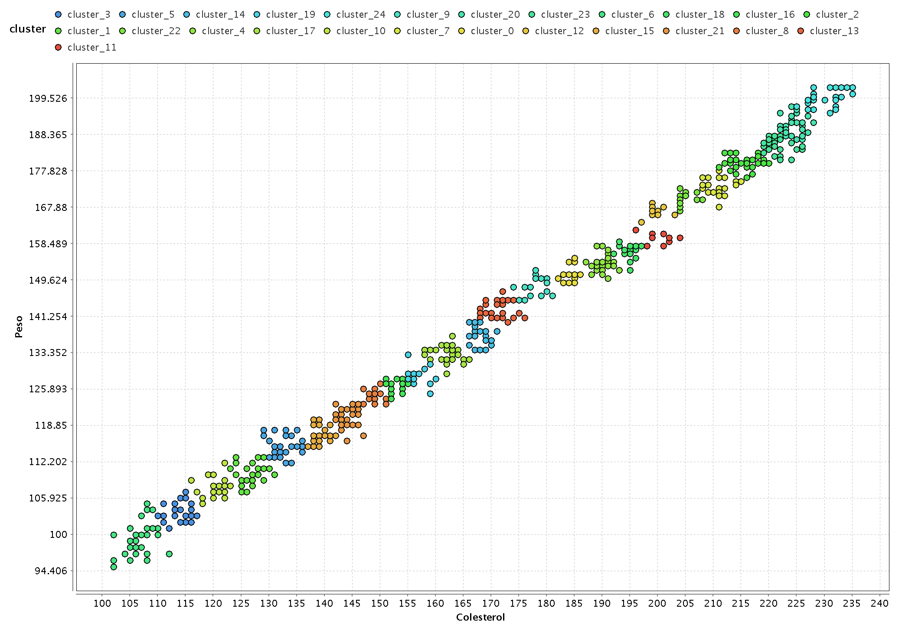

## Solución implementada para caso de estudio "Aprendizaje no supervisado"
[Volver](../index.md)

En este caso buscaremos identificar aquellos pacientes que poseen altas probabilidades de tener enfermedades coronarias. 
 [Dataset](k-means-cardio.csv).

### Paso 1 - Análsisis de la data
Analizar datos del data set.
Con el objetivo de detectar outliers.

### Paso 2 - Implementación 1
Como no se encontraron outliers, se procedió hacer utilización del operador de K-Means de RapidMiner.
Implementar modelo en RapidMiner Studio como el que se aprecia en la imagen de abajo.

[Proceso de RapidMiner completo (.rmp)](./ut5_ta1.rmp)

En esta primera instacia se creó el un modelo con 4 klusters.

## Paso 3 - Implementación 1 estudio de la salida
Número de instancias en el cluster.
Cluster 0: 135 items

Cluster 1: 140 items

Cluster 2: 118 items

Cluster 3: 154 items

Total number of items: 547

### Gráfica de los atributos.

Como se puede apreciar en el esta gráfica el sexo no es un atributo determinante para formar clusters.

### Colesterol y Peso
Dicho lo anterior de procedió a realiar la siguiente gráfica. Donde solamente se tiene presente el colesterol y el peso.

En este caso se puede apreciar claramente 4 grupos de riesgos. Considerando aquellos grupos que están mas arriba como los más riesgosos, ya que poseen mayor peso y colesterol.

### Centroides

### Paso 4 - Implementación 2

En este caso probó con k = 2.

En este caso se puede apreciar 2 grupos de riesgos con los siguientes centroides.

## Conclusiones

Este proceso de estudio de k clases, podría continuar. Y dependiendo de la necesidad que tenga el médico tratante, y a cuantos pacientes quiera llegar, en le mejor caso se quedrá avisar sobre recomendaciones a todos los pacientes, pero si esto no es posible y le que queremos avisar aquellos 20 más graves por ejemplo, se puede utilizar k=25 aproximadamente para avisarle aquellos realmente más graves.

k= 25.

[Volver](../index.md)